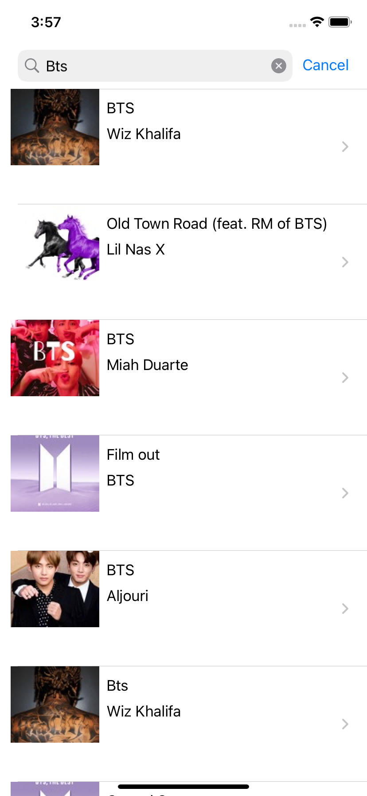
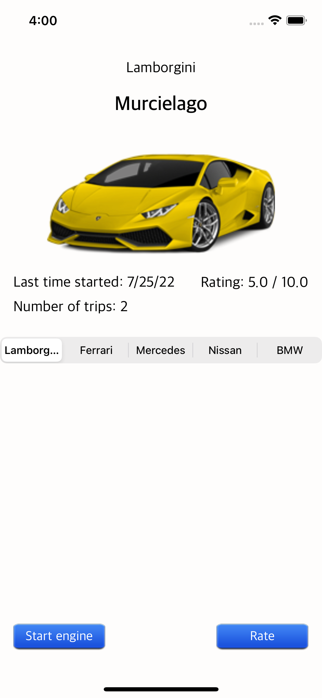
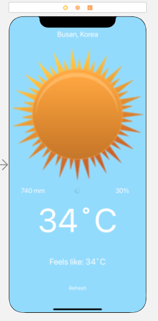

&nbsp;&nbsp;&nbsp;

## MusicSearch App
[MusicSearch App] is an app to find music in ITunes.

##### 🔨Technologies: UiKit, MVC , RestApi;
##### 🚀Platform: 📱iOS.

## CarApp
[CarApp] is an iOS app made to study CoreData.
##### 🔨Technologies: UIKit, MVC, CoreData;
##### 🚀Platform: 📱iOS;

## WeatherApp
[WeatherApp] is an app that provides current weather in choosen city.

##### 🔨Technologies: Swift, UIKit, API.
##### 🚀Platform: 📱iOS

## MapApp
[MapApp] is an app to find shortest path between current location and destination using MapKit and allows to track location of user.

##### 🔨Technologies: Swift, UiKit, MVC, MapKit.
##### 🚀Platform: 📱iOS

## CAReplicator
[CAReplicator] is an app for demonstrating CALayer.

##### 🔨Technologies:, Swift, CALayer
##### 🚀Platform: 📱iOS, iPad.

*Do not hesitate to contact me if you would like to get a promo code to have a look at any of my indie apps.*
